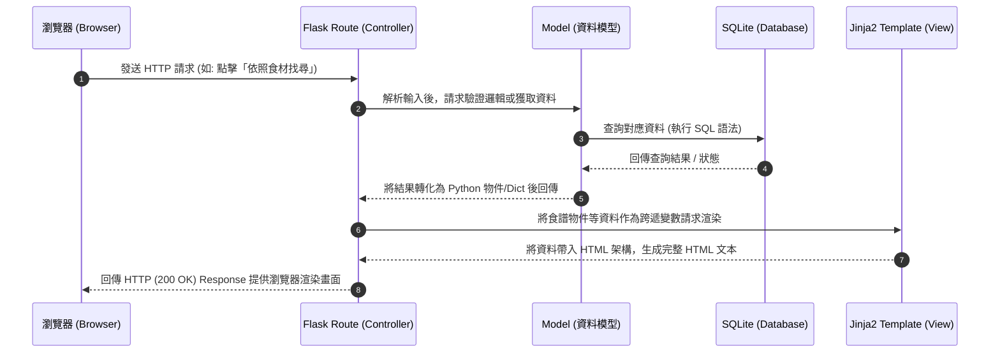

# 系統架構文件 (Architecture) - 食譜收藏夾系統

## 1. 技術架構說明

本系統採用傳統的 MVC（Model-View-Controller）設計模式，頁面由後端統一渲染後回傳給瀏覽器。這樣的架構有利於快速開發，特別適合將核心焦點放在資料呈現的網頁應用。

**選用技術與原因：**
- **後端：Python + Flask**
  輕量級的後端框架，不強制規定專案結構，開發者擁有極大的彈性，非常適合快速開發中小型的網頁專案。
- **模板引擎：Jinja2**
  Flask 內建的模板引擎，能方便將 Python 變數與邏輯（如迴圈、條件判斷）動態渲染到 HTML 中，直接呈現頁面。
- **資料庫：SQLite**
  無需架設與管理獨立的資料庫伺服器，將資料直接儲存在本地檔案中，非常輕量，完美迎合 MVP 階段的開發與部署需求。

**Flask MVC 模式對應與職責：**
- **Model (模型)**：負責定義資料結構與操作邏輯（與 SQLite 資料庫進行溝通）。這部分集中管理所有資料操作，如新增使用者、搜尋符合特定食材組合的食譜。
- **View (視圖)**：負責呈現使用者介面。在我們的專案中，View 主要是 `templates/` 目錄下的 Jinja2 HTML 模板檔，這些檔案只負責呈現資料與接收使用者輸入，不包含複雜商業邏輯。
- **Controller (控制器)**：負責接洽請求並處理商業邏輯。對應到 Flask 的路由（Routes），負責接收瀏覽器的請求（如 GET / POST），請求 Model 處理並獲取資料，接著將資料送至 Jinja2 模板予以渲染，最後把結果回傳給使用者。

## 2. 專案資料夾結構

因應未來系統擴充，我們將專案進行模組化分割（如利用 Flask Blueprints），不把所有程式碼放在單一檔案。

```text
web_app_development/
├── app/                        # 應用程式的主資料夾
│   ├── models/                 # [Model] 資料庫模型宣告與操作邏輯
│   │   ├── __init__.py
│   │   ├── user.py             # 使用者模型 (包含雜湊密碼欄位)
│   │   └── recipe.py           # 食譜模型 (含食譜本體、關聯食材與步驟)
│   ├── routes/                 # [Controller] Flask 路由邏輯 (Blueprints)
│   │   ├── __init__.py
│   │   ├── auth.py             # 身分驗證 (登入/註冊/登出)
│   │   ├── recipe.py           # 食譜瀏覽、依食材組合搜尋、儲存功能
│   │   └── admin.py            # 後台管理員專屬功能
│   ├── templates/              # [View] Jinja2 HTML 模板檔
│   │   ├── base.html           # 全站共用基礎佈局 (包含 Navbar、Footer)
│   │   ├── auth/               # 登入與註冊畫面
│   │   ├── recipe/             # 搜尋結果、食譜細節與收藏清單畫面
│   │   └── admin/              # 後台管理介面
│   └── static/                 # CSS/JS 及圖片等靜態資源檔案
│       ├── css/
│       │   └── style.css       # 基礎樣式與共用設計系統
│       ├── js/
│       │   └── main.js         # 前端精簡互動 (如動態增減食材輸入框)
│       └── images/             # 存放平台圖片 (如無封面時的預設圖)
├── instance/                   # 環境變數與預設不進入 Git 版控的私密檔案區
│   └── database.db             # SQLite 資料庫檔案
├── docs/                       # 開發需求與架構說明等文件庫 (如 PRD、Architecture)
├── requirements.txt            # Python 依賴套件表 (Flask, sqlite 等)
└── app.py                      # 系統入口檔案，負責初始化 Flask 與註冊 Blueprints
```

## 3. 元件關係圖

以下展示使用者在瀏覽器點擊查詢功能時，系統內部元件的資料流互動與處理順序：



## 4. 關鍵設計決策

1. **依功能別分割的路由系統 (Blueprints / Controllers)**
   為避免 `app.py` 變得過於龐大難以維護，我們將核心邏輯以功能分類拆至 `routes` 資料夾內，分為「身份驗證(Auth)」、「食譜操作(Recipe)」及「管理後台(Admin)」。除了有助於團隊同時開發不同頁面外，更能確保後續若要串接 API 或擴增功能時，界線依然分明。

2. **多對多的資料夾規劃思維**
   針對「從食材組合搜尋食譜」的核心特點，這意味著「一個食譜包含多種食材、一種食材也會出現在多種食譜中」。在架構上，將透過 `models` 資料夾中的設計，於 SQLite 內實作多對多關聯表（Recipe-Ingredient Mapping），這樣後續 SQL 查詢「包含特定食材交集」的食譜時，效率才會高。

3. **安全考量：輕量但不妥協的密碼保護**
   即使只使用最簡單的 SQLite 資料庫來開發，針對使用者帳號密碼仍會在 Controller 到 Model 的轉換環節之間導入 `werkzeug.security` 的雜湊加密 (Hash)，絕對不以明文寫入檔案當中，這是 Web 開發的基礎守則。

4. **精簡前端依賴：以原生 JavaScript 取代大型框架**
   考慮到需求著重於後端與資料關聯性的展現，前端介面選用無框架的 HTML / CSS / 原生 JS。對於需要動態調整的地方（例如增加搜尋菜色用的欄位框），將只透過簡單的 DOM 操作完成，以此降低額外編譯帶來的複雜度。
