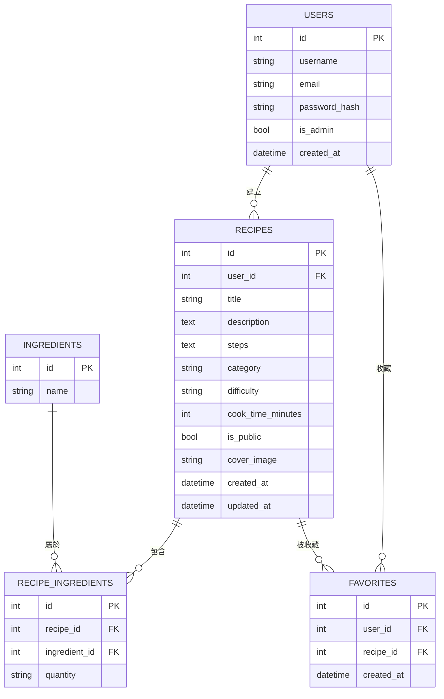

# 資料庫設計文件 (DB_DESIGN) - 食譜收藏夾系統

本文件根據 PRD.md、FLOWCHART.md 與 ARCHITECTURE.md，定義 SQLite 資料庫的資料表結構、欄位說明與關聯設計。

---

## 1. ER 圖（實體關係圖）

---

## 2. 資料表詳細說明

### 2.1 `users` — 使用者

| 欄位名稱 | 型別 | 必填 | 說明 |
| :--- | :--- | :---: | :--- |
| `id` | INTEGER | ✅ | 主鍵，自動遞增 |
| `username` | TEXT | ✅ | 使用者顯示名稱，全站唯一 |
| `email` | TEXT | ✅ | 電子郵件，全站唯一，用於登入 |
| `password_hash` | TEXT | ✅ | 使用 `werkzeug.security` 雜湊後的密碼，永不明文儲存 |
| `is_admin` | INTEGER | ✅ | 管理員標記，0 = 一般使用者，1 = 管理員，預設為 0 |
| `created_at` | TEXT | ✅ | 帳號建立時間，儲存 ISO 8601 格式字串 |

- **Primary Key**: `id`
- **唯一索引**: `username`, `email`

---

### 2.2 `recipes` — 食譜

| 欄位名稱 | 型別 | 必填 | 說明 |
| :--- | :--- | :---: | :--- |
| `id` | INTEGER | ✅ | 主鍵，自動遞增 |
| `user_id` | INTEGER | ✅ | 外鍵，對應 `users.id`，代表建立者 |
| `title` | TEXT | ✅ | 食譜名稱 |
| `description` | TEXT | ❌ | 食譜簡介說明 |
| `steps` | TEXT | ✅ | 料理步驟（JSON 格式字串儲存步驟陣列） |
| `category` | TEXT | ❌ | 食譜分類（如：家常、甜點、健身） |
| `difficulty` | TEXT | ❌ | 難易度（easy / medium / hard） |
| `cook_time_minutes` | INTEGER | ❌ | 預計料理時間（分鐘） |
| `is_public` | INTEGER | ✅ | 公開狀態，1 = 公開，0 = 私人，預設為 1 |
| `cover_image` | TEXT | ❌ | 封面圖片路徑或 URL |
| `created_at` | TEXT | ✅ | 建立時間，ISO 8601 格式 |
| `updated_at` | TEXT | ✅ | 最後更新時間，ISO 8601 格式 |

- **Primary Key**: `id`
- **Foreign Key**: `user_id` → `users(id)`
- **索引**: `user_id`, `is_public`, `category`

---

### 2.3 `ingredients` — 食材

| 欄位名稱 | 型別 | 必填 | 說明 |
| :--- | :--- | :---: | :--- |
| `id` | INTEGER | ✅ | 主鍵，自動遞增 |
| `name` | TEXT | ✅ | 食材名稱，全站唯一（如：雞蛋、番茄） |

- **Primary Key**: `id`
- **唯一索引**: `name`（避免重複食材）

---

### 2.4 `recipe_ingredients` — 食譜食材關聯（多對多中間表）

| 欄位名稱 | 型別 | 必填 | 說明 |
| :--- | :--- | :---: | :--- |
| `id` | INTEGER | ✅ | 主鍵，自動遞增 |
| `recipe_id` | INTEGER | ✅ | 外鍵，對應 `recipes.id` |
| `ingredient_id` | INTEGER | ✅ | 外鍵，對應 `ingredients.id` |
| `quantity` | TEXT | ❌ | 食材用量描述（如：2 顆、100g） |

- **Primary Key**: `id`
- **Foreign Keys**: `recipe_id` → `recipes(id)`、`ingredient_id` → `ingredients(id)`
- **唯一複合索引**: `(recipe_id, ingredient_id)`（同一食譜不重複加同一食材）
- **設計說明**: 此表實現「從食材組合搜尋食譜」的核心功能。透過 `GROUP BY` + `HAVING COUNT` 可查詢同時包含多種食材的食譜。

---

### 2.5 `favorites` — 使用者收藏

| 欄位名稱 | 型別 | 必填 | 說明 |
| :--- | :--- | :---: | :--- |
| `id` | INTEGER | ✅ | 主鍵，自動遞增 |
| `user_id` | INTEGER | ✅ | 外鍵，對應 `users.id` |
| `recipe_id` | INTEGER | ✅ | 外鍵，對應 `recipes.id` |
| `created_at` | TEXT | ✅ | 收藏時間，ISO 8601 格式 |

- **Primary Key**: `id`
- **Foreign Keys**: `user_id` → `users(id)`、`recipe_id` → `recipes(id)`
- **唯一複合索引**: `(user_id, recipe_id)`（一個使用者對一個食譜只能收藏一次）

---

## 3. 關聯總覽

| 關聯 | 類型 | 說明 |
| :--- | :--- | :--- |
| users → recipes | 一對多 (1:N) | 一位使用者可建立多個食譜 |
| recipes ↔ ingredients | 多對多 (M:N) | 透過 recipe_ingredients 中間表實作 |
| users ↔ recipes (收藏) | 多對多 (M:N) | 透過 favorites 中間表實作 |
