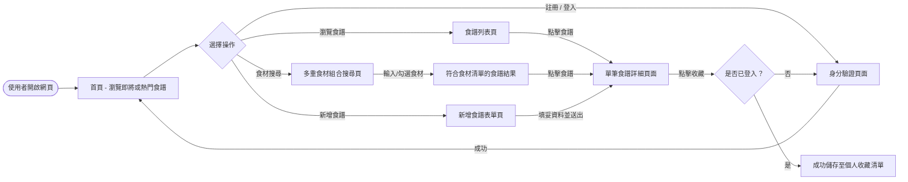
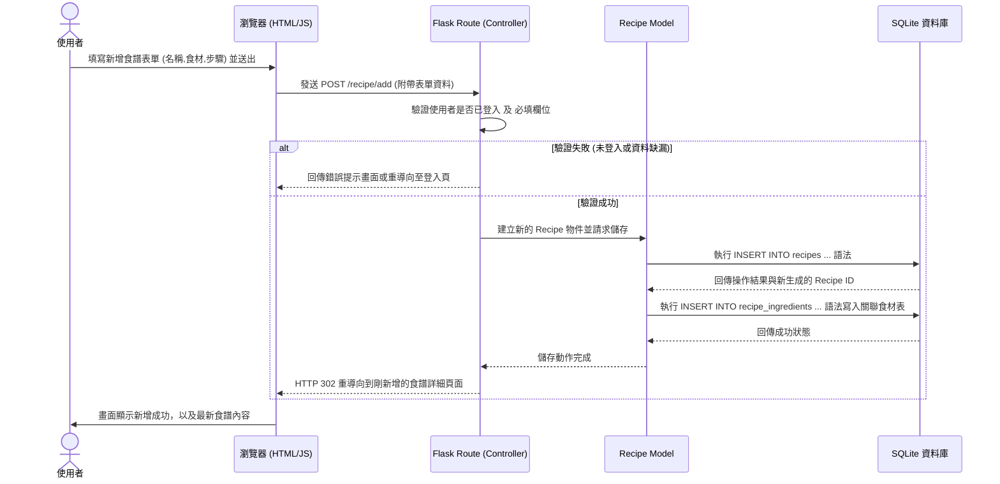

# 流程圖文件 (FLOWCHART) - 食譜收藏夾系統

本文件基於 PRD 與系統架構設計，繪製了使用者的操作流程圖及系統資料處理序列圖。

## 1. 使用者流程圖 (User Flow)

此流程圖展示一般使用者進入系統後，可以執行的主要操作路徑，包含註冊登入、食譜搜尋、食材過濾及個人收藏管理。

## 2. 系統序列圖 (Sequence Diagram)

此圖以「一般使用者新增並儲存一份食譜」為例，展示完整的前端、後端與資料庫的互動流程。

## 3. 功能清單對照表

本表列出了 MVP 階段核心功能的 URL 路徑規劃及對應的 HTTP 請求方法，為後續開發階段建立明確標準：

| 功能描述 | URL 路徑 (Route) | HTTP 方法 | 視圖/處理說明 |
| :--- | :--- | :--- | :--- |
| 首頁 (瀏覽推薦食譜) | `/` | GET | 呈現網站首頁 |
| 註冊畫面 | `/auth/register` | GET | 呈現註冊表單 |
| 處理註冊請求 | `/auth/register` | POST | 驗證欄位、雜湊密碼並建立使用者資料 |
| 登入畫面 | `/auth/login` | GET | 呈現登入表單 |
| 處理登入邏輯 | `/auth/login` | POST | 驗證帳戶密碼，通過後建立 Session |
| 登出系統 | `/auth/logout` | GET/POST | 清除現有 Session 並回首頁 |
| 瀏覽/搜尋食譜列表 | `/recipe/` | GET | 支援透過 `?q=關鍵字` 進行名稱搜尋 |
| 食材組合搜尋 | `/recipe/ingredients` | GET | 依據選擇的食材進行複合條件過濾 |
| 新增食譜畫面 | `/recipe/add` | GET | 呈現建立新食譜的輸入表單 (需登入) |
| 處理新增食譜 | `/recipe/add` | POST | 將資料寫入 DB，含多筆食材關聯 |
| 真實食譜內容頁 | `/recipe/<int:id>` | GET | 顯示指定編號的食譜細節 |
| 收藏/取消收藏食譜 | `/recipe/<int:id>/favorite` | POST | 操作收藏關聯資料 |
| 查看我的收藏清單 | `/user/favorites` | GET | 列出該使用者已收藏的所有食譜 |
| 後台管理控制台 | `/admin/` | GET | 顯示全站資料總覽面板 (需管理者權限) |
| 強制刪除違規食譜 | `/admin/recipe/<int:id>/delete`| POST | 管理人員將特定內容自資料庫剔除 |
